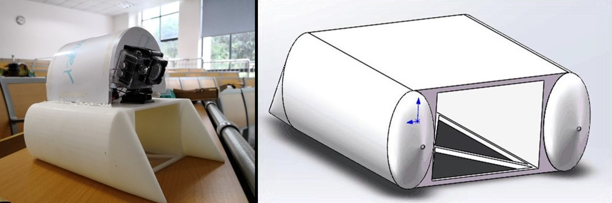

+++
# Date this page was created.
date = 2018-11-10T00:00:00
layout = "project"

# Project title.
title = "3D Printed Catamaran"

# Project summary to display on homepage.
summary = """
 To solve the problem of floating trash on water surface, we designed a small catamaran and 3D printed
 it.  

 """
 
# image_preview = "MIPS_CPU/FPGA.png"

# Tags: can be used for filtering projects.
# Example: `tags = ["machine-learning", "deep-learning"]`
tags = ["Robotics","Simulation"]

# Optional external URL for project (replaces project detail page).
external_link = ""

+++

### An Innovative Practical Mini Catamaran, Xcavenger
1.	Designed the catamaran in SolidWorks and 3D printed it. With infrared control, it was able to accomplish simple tasks such as water surface refuse collection. 
2.	Completed the business plan for the project. The project was awarded as Excellence (top 10%) in the College Students Innovation and Entrepreneurship Competition (2018) of UESTC.

### Design
We designed a small catamaran which could capture the floating trash and 3D printed it. By differentiating
the speed of two motors, the direction of the surface robot could be changed easily.  
<figure class = "half">
	
</figure>
After tests, we proposed future improvements:  
1. Improve its flexibility and maneuverability.  
2. Apply object detection and localization, automate the task.  
I cooperated with Qizhou Wang, Yue Zhao. We drafted the business plan for this project. (not a real one,
just a practice)

### Test Video
<video src="./Xcavenger.mp4" controls="controls" width="640" height="320" autoplay="autoplay">
Your browser does not support the video tag.
</video>
